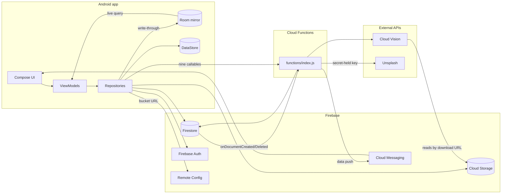

# Architecture

The deeper reference for how SmartPhotos is put together. [AGENTS.md](AGENTS.md) is loaded into
every agent conversation, so it states rules and keeps the reasoning short; **this file holds the
reasoning** — the incidents that produced a rule, the alternatives that were tried and rejected, and
the background an agent only occasionally needs. Read it when you want to know *why*, or when you
are about to change something a rule protects.

## System overview

Two deployables share one Firebase project:

- **Android app** — Kotlin + Jetpack Compose, MVVM, across twenty-seven Gradle modules: `:app`,
  `:core:domain`, `:core:common`, `:core:data`, the multiplatform `:core:datastore`, `:core:ui`,
  nine `:feature:*` libraries plus the multiplatform `:feature:<name>-viewmodel` modules (`auth`,
  `explore`, `favorite`, `home`, `note`, `preview`, `profile`, `search`, `settings`), and the
  four test-only modules `:core:testing` / `:core:domain-testing` / `:core:screenshot-testing` /
  `:core:ui-testing`. Plus
  `build-logic/`, an included build holding the seven convention plugins. The per-module contents and
  the dependency rules are in [AGENTS.md](AGENTS.md).
- **Cloud Functions** (`functions/`, Node 24) — triggered by Firestore writes and callable from the
  app, doing the work that shouldn't run on-device: calling Google Cloud Vision, enforcing limits
  the client can't be trusted to enforce, proxying secrets.

Two edges are worth reading twice. The pair between `Repo`, `Room` and `VM` is the
[Source of truth](AGENTS.md#source-of-truth) arrangement: a repository writes what it fetched into
Room, and the ViewModel reads it back out of a live query rather than from the call's return value —
which is what replaced the cross-feature event bus described below.

`Repo → CF` is the other. Cloud Functions are **not** reached only by Firestore triggers: nine of the
eleven are callables a repository invokes directly through `FirebaseFunctions.getHttpsCallable`
(`createNote`/`updateNote` from `DefaultNoteRepository`, the two username/email checks from
`DefaultAuthRepository`, three profile callables from `DefaultUserRepository`, the two Unsplash ones
from `DefaultPhotoRepository`). Only `processTextRecognition` and `archiveDeletedNote` fire from a
Firestore write. Note also that nothing server-side touches Cloud Storage: `processTextRecognition`
passes Vision the image's download URL, so **Vision** fetches the bytes.

## Why the module split is shaped this way

The dependency rules in AGENTS.md are enforced at configuration time by
`smartphotos.android.feature`, which fails the build if a feature declares an edge to another
feature or to `:core:data`. That enforcement exists because **the one violation this build actually
shipped was invisible to review**: `:core:testing` declared `:core:data`, unused, on an `api`
configuration. Being `api`, it put Firestore, Room, DataStore and Play app-update on the unit-test
compile classpath of all nine feature modules — so "no feature depends on `:core:data`" held for
main sources and quietly failed for tests. Nobody had read a build file wrong; the rule was simply
held by convention, and conventions decay. Hence the check scans *every* declaration bucket, not
only the compile ones.

Removing that edge also freed `:core:data` to take `:core:testing` on `testImplementation` if a
suite there ever wants the fakes — with the edge in place that would have been a cycle. The general
form: **a fixtures module is a supplier to the data layer or a consumer of it, never both.**

`:core:screenshot-testing` was split out of `:core:testing` for the same reason, one layer over.
Everything in a fixtures module is `api`, so the harness's Roborazzi and Robolectric artifacts
landed on the unit-test compile classpath of all nine features plus `:app` and `:core:ui` —
including `:feature:explore`, which captures no screenshots and has no androidTest source set at
all, yet resolved the entire compose ui-test stack. The tell that nobody was relying on the leak:
every module wanting Robolectric for a *non*-screenshot suite (`:app`, `:core:data`,
`:feature:auth`, `:feature:note`, `:feature:preview`) already declared it itself.

`:core:ui-testing` is the same split a third time. `BaseScreenTest` is shared test code, which is
what `:core:testing` is for — but `:app` and `:core:ui` take that module too, so its compose-ui-test
artifacts would have landed on their classpaths exactly as Roborazzi once landed on nine features.
It cleared the "one module is a sample size of one" bar well before it was written: eleven suites
declared their own `string(resId)`, eight a byte-identical `waitForText`, and the 5s timeout
appeared as a literal thirty-three times. And it costs no consumer a new artifact — the nine
features already resolve compose-ui-test on both test source sets, since
`smartphotos.android.feature` puts `androidx-ui-test-junit4` there for the screen suites themselves.
**Fixtures in one module, a harness in another, each depended on only by what wants it.**

**None of the three is AGP's `testFixtures`.** That was tried first and doesn't work here: the
Kotlin Android plugin generates no Kotlin compilation for the testFixtures variant, so the sources
never build. All three are ordinary library modules, `api` throughout, because a fixtures module's
API surface is *other* modules' types — `FakeNoteRepository` **is** a `NoteRepository`.

`FirebaseModule` moved from `:app` to `:core:data` under the same kind of reasoning. Hilt aggregates
every `@InstallIn(SingletonComponent::class)` module into one component generated in `:app`, so a
provider works from anywhere and nothing fails if it sits too high — which is exactly why it sat in
the wrong place for so long. It provided six Firebase SDK singletons — Firestore, Auth, Functions,
Remote Config, Analytics and Messaging — whose only consumers were `:core:data` repositories, which
put the whole Firebase surface in `:app`'s dependency block for code `:app` does not contain, and
meant nothing below `:app` could assemble a repository on its own. (A seventh,
`provideFirebaseInAppMessaging`, did not come along: nothing injected it, which is the
unused-binding incident recorded below.)
**Ask where a binding is injected, not where it is convenient to declare.**

## Layers

| Layer | Location | Responsibility |
| --- | --- | --- |
| UI | `<feature>/*Screen.kt` (`:feature:*`), `navigation/` (`:app`) | Render `UiState`, forward user intents. No Firebase/Room/DataStore calls, no business logic beyond UI-only state. |
| ViewModel | `<feature>/*ViewModel.kt` (`:feature:<name>-viewmodel`, `commonMain`) | Open and annotation-free; Hilt builds its `Hilt<Name>ViewModel` subclass in `:feature:<name>`. Exposes a `*UiState` via `StateFlow` wrapping a nested sealed loading/loaded/error content type. Depends on repository *interfaces* only. |
| Repository | interfaces in `:core:domain` (plus two in `:core:common`/`:core:data`), `Default*` implementations in `:core:data` (one in `:core:datastore`) | Coordinates remote (Firestore/Storage/Functions) and local (Room/DataStore). Exposes domain models only. Every fallible operation returns `Result<T>` via `safeCall`. |
| Domain | `domain/` (`:core:domain`) | Plain data classes (`Note`, `MediaDetail`, `User`, …). A multiplatform module, so `commonMain` compiles against the intersection of `jvm` and two iOS targets and neither `import android.*` nor `import java.*` resolves. |
| Local | `database/` (`:core:data`), `data/datastore/` (the repository in `:core:datastore`, the DataStore it wraps built in `:core:data`) | The Room mirror and preferences. Schemas exported to `core/data/schemas/`. |
| Remote | Firebase SDKs + `functions/index.js` | Auth, Firestore, Storage, Remote Config, Analytics, Crashlytics, FCM; Cloud Functions for anything needing a trusted server. |

Two repository interfaces cannot live in `:core:domain`, because their signatures carry Android
types. `AppUpdateRepository` (`ActivityResultLauncher`/`IntentSenderRequest`) stays in `:core:data`
beside its implementation, since only `:app`'s `MainViewModel` injects it. `MediaFileRepository`
(`Bitmap`/`Uri`) sits in `:core:common`, where it came down because a feature module injected it and
must not depend on `:core:data`. Every method whose result crossed layers has since split off into
`:core:domain`, returning a `MediaUri`: `downloadToCacheFile` as `MediaCacheRepository`, and
`createPhotoUri`/`createVideoUri` as `MediaCaptureRepository`. `DefaultMediaFileRepository`
implements all three. What is left of `MediaFileRepository` is called only inside `:core:data`; it
stays in `:core:common` because `FakeMediaFileRepository` in `:core:testing` implements it. Move the
next Android-typed interface down only when a feature actually needs it.

## Cross-feature updates, and the `*Handler` pattern that was removed

**There is no cross-feature event mechanism any more. Do not rebuild one.** If you find a comment
mentioning `NoteHandler` or `NoteActionsDelegate`, it is describing what the code used to do — both
classes are gone, and the comments were left deliberately to explain the absence.

The old arrangement: `home` and `favorite` held paginated, in-memory lists rather than a live query,
so a write in `note` (add/delete/favorite) did not propagate into a page `home` already had in
memory. To bridge that, each domain that needed to notify siblings had a `@Singleton` `*Handler`
exposing a `MutableSharedFlow` per event; the mutating ViewModel emitted after a successful write
and interested ViewModels collected in `init {}` and patched their own list.

It was removed because a default `MutableSharedFlow` has no replay, so a subscriber only receives an
event if it is actively collecting at emission time — the target ViewModel had to already be
constructed and past its `init {}`. That made it safe for "patch an already-visible list" and unsafe
for anything a screen must not miss, which is a distinction every future caller would have had to
re-derive correctly.

What replaced it is the Room mirror: the four note-rendering screens observe a live query over the
`notes` table, so a mutation on any screen shows up on every other screen with no event to deliver
and nothing to miss. `addNote` reading its own note back via `getNote` is what made this possible —
that one extra document read retired the `NoteHandler` event telling Home to refetch everything.
`NoteActionsDelegate` inlined into a small list transform in each ViewModel at the same time, since
there was no longer any shared subscription for it to own. The two ViewModel-scoped survivors
are `NoteShareDelegate` (share-sheet plumbing) and `NoteErrorReporter` (the `actionError` snackbar
flow) — in `:core:domain`'s `commonMain` since the multiplatform work, with their Hilt wiring in
`:core:common`.

**The one event that remains** is `note/IncomingShareHandler.kt`, an event a screen genuinely must
not miss (an inbound Android share intent). It is deliberately *not* a `SharedFlow`: it is a
`StateFlow` holding the pending value plus an explicit `consume()`, so a subscriber that starts
collecting late still sees it. Copy that shape, not the old one, if a second such case ever appears.

The rules that keep the mirror correct — the `limit` on `getNotesStream`, mirror-write failures
having to fail the fetch, every remote read writing what it fetched, and the empty-state handling on
a fresh install — are in [AGENTS.md](AGENTS.md#source-of-truth), along with the two known gaps (no
offline writes, no reconciliation).

## Data flow: uploading a photo/note with ML tagging

This is the path that motivates having Cloud Functions at all:

1. The app uploads media to Cloud Storage (`DefaultMediaUploadRepository.uploadMedia`) and writes a
   note document to Firestore under `user/{userId}/note/{noteId}` (`DefaultNoteRepository`), then
   writes it through to Room — two repositories, because uploading a file and persisting a note are
   two jobs. `uploadMedia` runs under its caller's job (`coroutineScope { async }` inside
   `NoteViewModel.saveNote`'s `viewModelScope.launch`), so it is cancelled if the ViewModel is
   cleared mid-upload — official guidance for work that should survive that
   ([Guide to background work](https://developer.android.com/guide/background)) is `WorkManager`,
   which this codebase does not use today. **`uploadMediaToCache` is not this path and behaves the
   opposite way**: it is the fire-and-forget cache upload (a cancelled capture, a profile picture)
   and hands each file to `@ApplicationScope`, so clearing the ViewModel cannot kill it.
2. `processTextRecognition` (an `onDocumentCreated` trigger) fires server-side, calls Cloud Vision
   (text/label/object detection) on the uploaded image, and writes the results back onto the
   document.
3. The tags reach the app by two routes, and neither is a Firestore listener — there is no
   `addSnapshotListener` anywhere in the build. `processTextRecognition` sends a **data-only** FCM
   push carrying `noteId` (data-only so `SmartPhotosMessagingService.onMessageReceived` always runs
   and the deep link survives a backgrounded app), but only for a note that actually carries media;
   the tap deep-links into `MainActivity` with `EXTRA_NOTE_ID`. The tag *data* arrives separately,
   whenever the next `getNote`/`getNotes` fetch writes the note into the Room mirror — so a Vision
   run finishing after a screen has loaded shows up on that screen's next fetch, not the moment it
   is written.
4. On deletion, `archiveDeletedNote` (`onDocumentDeleted`) copies the note's Firestore data to
   `user/{userId}/archive/{noteId}` with a `deleted_at` timestamp, so it is recoverable rather than
   destroyed. The note's Storage files are left untouched.

The callable functions — `createNote`, `updateNote`, `isUsernameAvailable`, `isEmailRegistered`,
`createUserProfile`, `updateUsername`, `recordUserActivity`, `listUnsplashPhotos`,
`searchUnsplashPhotos` — exist because each needs a trusted environment: enforcing limits
(`MAX_USERNAME_LENGTH`, `MAX_NOTE_TEXT_LENGTH`, `MAX_NOTE_MEDIA_ITEMS`, reserved-username checks) a
modified client can't be trusted to self-enforce, holding a secret (`UNSPLASH_ACCESS_KEY`, via
`defineSecret`) that must never ship inside the APK, or — for `recordUserActivity` — needing a
Firestore transaction to compute streak continuation atomically against another device's concurrent
write. **Client-side checks mirroring these are UX-only; the functions are the enforcement
boundary.**

`createNote` returning only `{documentPath}` is why `addNote` reads its note back: the id and the
server-stamped `created` exist only server-side.

## Firestore collections

`firestore.rules` is deny-by-default; per-collection rules are additive (OR'd).

- `user/{userId}` — profile data, with a `note/{noteId}` sub-collection holding each user's notes
  (content, media metadata, Vision-derived tags). **This is where notes actually live.**
- `note/{noteId}` — a top-level collection of the same name exists but is explicitly locked down
  (`allow read, write: if false`) since the app doesn't use it. Don't confuse it with the
  sub-collection above.
- `username/{username}` — reservation records enforcing unique usernames, written via the
  `isUsernameAvailable`/`updateUsername` callables rather than direct client writes, so the
  reserved-word list in `functions/index.js` is enforced consistently.
- `user/{userId}/archive/{noteId}` — deleted notes plus a `deleted_at` timestamp, written by
  `archiveDeletedNote`. Fully locked down: it backs a server-side recovery mechanism, not a
  user-facing feature.

## Local persistence

Room (`database/`) mirrors a subset of Firestore for the read path:

- `NoteDao` / `DatabaseNote` (`@Entity(tableName = "notes")`) — the mirror the four note-rendering
  screens observe, and the only table in the database. (`PhotoDao` / `DatabasePhoto` used to sit
  beside it and was dropped in the v1 -> v2 auto-migration; no production code ever read it.)

**A note's media list persists into the `notes.media_list` column as `kotlinx.serialization` JSON
keyed by `MediaDetail`'s property names.** That is an on-disk format, so renaming a property needs
`@SerialName` to keep old rows decodable. DataStore (`data/datastore/`) holds lightweight
preferences, not domain data.

Room is written through by the repository after the Firestore write returns, never independently —
see [Source of truth](AGENTS.md#source-of-truth).

**Everything per-user on the device is erased in one place, `data/LocalUserDataCleaner.kt`**, called
by `DefaultAuthRepository` on both sign-out and delete-account. It holds the whole list — the notes
table, and the user-scoped DataStore keys via `clearUserScopedPreferences()` — so adding a store is
a line here rather than a method on the auth repository somebody has to remember to edit. The auth
repository injected `NoteDao` directly before that, and the DataStore had already been forgotten:
the previous account's `username` and `profilePictureUrl` survived a sign-out, and the sign-in path
only overwrites them when `getUser()` succeeds. The theme is deliberately not user data and
survives.

## Dependency injection graph

Hilt. Every `@Provides`/`@Binds` module but one is `@InstallIn(SingletonComponent::class)`, and
the component is assembled in `:app` — which is why `:core:data` can inject `@IoDispatcher` and
`@DebugBuild` while their providers stay in `:app`'s `AppModule`.

| Module | Lives in | Provides |
| --- | --- | --- |
| `di/AppModule.kt` | `:app` | `CoroutineDispatcher`s via `@IoDispatcher`/`@ApplicationScope`, the `@DebugBuild` flag, app-wide bindings |
| `util/di/UtilModule.kt` | `:app` | `ErrorHandler` (logging only; screens resolve their own text) |
| `data/di/DataModule.kt` | `:core:data` | Binds each repository interface to its `Default*`, and constructs `DefaultUserPreferencesRepository`, which has no injected constructor to bind |
| `data/di/FirebaseModule.kt` | `:core:data` | The Firebase SDK singletons |
| `data/datastore/DataStoreModule.kt` | `:core:data` | DataStore, and the one deliberate place a `CoroutineScope` is built at module level rather than injected |
| `database/di/DatabaseModule.kt` | `:core:data` | `AppDatabase` and its DAOs |
| `note/di/NoteDelegateModule.kt` | `:core:common` | `NoteErrorReporter` and `NoteShareDelegate`, `@ViewModelScoped` — the one module installed in `ViewModelComponent` |

`di/Qualifiers.kt` (`:core:domain`) holds the `@IoDispatcher`, `@ApplicationScope` and `@DebugBuild`
annotations themselves, kept apart from the providers because they are plain JSR-330 and can live in
a non-Android module while `@Provides` methods cannot. Since `:core:domain` went multiplatform
they sit in its `jvmMain` source set rather than `commonMain` — JSR-330 is a JVM artifact and Hilt
is Android-only, so they are the one thing in that module an iOS target could never use. Android
consumers resolve the `jvm` variant, so nothing at the injection sites changed.

**Not everything is a `@Singleton`.** `NoteShareDelegate` and `NoteErrorReporter` are
`@ViewModelScoped` — the
[scope](https://developer.android.com/training/dependency-injection/hilt-android#component-scopes)
that matches their actual lifetime, and a load-bearing one: the delegate reports share failures onto
the reporter its ViewModel exposes, so both must hold the same instance. They used to get it from a
plain `@Inject` constructor, with no module needed. Moving them to `:core:domain`'s `commonMain`,
where no annotation resolves, moved the scope into `NoteDelegateModule`'s `@Provides` methods — the
same bindings, declared at the Android edge. There is no per-feature `di/` package; bindings live in
one of the seven modules above.

## Incidents worth not repeating

Each of these produced a rule in AGENTS.md. They are recorded here because the rule is easy to
follow and hard to re-derive.

- **A `@Preview` broke the release build for weeks.** `:feature:auth` used a dependency that reached
  it only through `debugImplementation`, so `assembleDebug`, the unit tests, Roborazzi and
  `lintDebug` all compiled clean while `compileReleaseKotlin` failed. Nothing caught it because CI
  built no release either. `assembleRelease` is now a CI step, and
  `compileDebugAndroidTestKotlin` alongside it — between them they cover the two variants nothing
  else compiles. The androidTest one has its own catch to its name: `:core:data`'s DataStore and
  Room bindings.
- **The dependency sweep got the "loaded reflectively" exception wrong in both directions.**
  `firebase-inappmessaging-display` was kept because a `provideFirebaseInAppMessaging` binding named
  it — but nothing in the build ever injected that binding, and an unused Hilt binding reads exactly
  like a live one, with no import to be missing and no compile error to raise. **Check for an
  injection site before treating a `@Provides` as load-bearing.** `coil-gif` went the other way: it
  was removed because "nothing registers a GIF decoder here", which under Coil 3 is precisely what a
  *working* setup looks like. It and `coil-network-okhttp` ship a `META-INF/services` entry
  (`coil3.util.DecoderServiceLoaderTarget` / `FetcherServiceLoaderTarget`) that Coil reads when
  building an `ImageLoader`, so classpath presence **is** the registration. GIFs stopped animating
  and nothing failed to compile. **Look inside the artifact before deleting a dependency nothing
  imports.**
- **`:app` carried ML Kit ×4, GenAI, media3 ×4 and `material-icons-extended` long after the code
  that used them moved into feature modules.** Unused dependencies cost nothing at compile time, so
  they survive every refactor that should have removed them. A module declares what its own sources
  name.
- **KSP's incremental state goes stale when a type moves between modules**, producing a wall of
  `InjectProcessingStep was unable to process 'X(…,Foo,…)' because 'Foo' could not be resolved` for
  a type that is on the classpath and compiles fine alone. `./gradlew clean` fixes it. The tell is
  that the unresolved name is unqualified while its neighbours from the same module are fully
  qualified — check this before rearranging `api`/`implementation` declarations.
- **CI's artifact path lists drifted three times** while they were literal per-module paths:
  `:core:ui`, `:feature:explore` and `:feature:settings` each silently reported nothing for a while,
  which turns a failure in that module into a red X with nothing to open. They are globs now.
- **Screenshot goldens were machine-dependent** until the unit-test JVM was pinned to UTC/en-US, because
  `Long.toFormattedDateTime()` defaults `zone`/`locale` to the system's — they passed on a UTC+8
  laptop and failed on the UTC runner. A golden diff appearing only on CI is far more likely
  non-determinism in the test than a platform rendering difference.
- **Tests do not move themselves when their subject does, and nothing fails when they stay.** `:app`
  kept both `Default*Repository` suites and a screenshot test of two feature screens simply because
  its test classpath could still see everything. When a test *cannot* follow its subject down, that
  is a finding: those two suites were asserting the rendered error *message* through `:app`'s
  `DefaultErrorHandler`, a layer above their subject. Splitting the assertion at the `AppError`
  identity — the message half was already pinned by what is now `ErrorMessagesTest` in
  `:core:common`, where it belongs — is what let them move.
- **`ProfileScreenTest` is device-only on purpose.** Promoting it to `sharedTest/` was tried and
  three of five tests passed under Robolectric; its bottom-anchored save button and inline
  validation text depend on real viewport and scroll behaviour. Check an existing androidTest-only
  suite's own note before promoting it.
- **`smartphotos.android.feature` did not exist while `:feature:explore` was the only feature
  module**, because with one consumer there is no way to tell *the shape of a feature* from *the
  shape of Explore*. The second consumer answered it, and partly against expectation — the icon
  packs, assumed Explore-specific, turned out to be shared. One module is a sample size of one.
- **Espresso's version decided whether any device suite ran, and nothing named it.** A Compose rule
  syncs through `Espresso.onIdle()` on device, and `androidx.test.ext:junit` carries a transitive
  espresso-core 3.5.0 that reaches for `InputManager.getInstance`, removed in API 36. Every feature
  resolved that transitive version while `:app`, the one module declaring espresso for itself,
  resolved the catalog's 3.7.0 — 51 failures across seven modules, all dying in `onIdle` before
  their first assertion, with `:app` green beside them. `smartphotos.android.feature` declares it
  now. When a device run fails identically in every suite, suspect the classpath before the
  assertions.
- **The first CI run that executed the instrumented tests went red in a module that has none.**
  A device-test task does not skip itself when a module has no tests: AGP decides by looking for
  class files in the androidTest output, and its own filter subtracts the R and BuildConfig *jars*
  rather than the copies of those classes compiled into the project scope's jar. So `:core:common`
  built an androidTest APK holding nothing but `R`, AGP installed it, and the instrumentation died
  on `ClassNotFoundException: androidx.test.runner.AndroidJUnitRunner` after starting zero tests —
  a module with no instrumented tests has no reason to declare a runner.
  `disableAndroidTestWithoutSources` now turns the component off wherever `src/androidTest/` and
  `src/sharedTest/` are both absent. The other half of the incident is what the job did *not* say:
  it stopped at the first failure, so the nine feature suites queued behind it never ran on the one
  run that was meant to run them. It passes `--continue` now — the emulator-side equivalent of the
  `android` job's per-step `!cancelled()`.

## Kotlin Multiplatform

The long-term intent is to share `domain/`, the repository interfaces and other business logic. The
day-to-day rules that keep that cheap are in [AGENTS.md](AGENTS.md#kotlin-multiplatform-readiness);
this is the state of play.

### What is done

**`:core:domain` is a `kotlin.multiplatform` module** — `jvm()` plus `iosArm64` and
`iosSimulatorArm64`, via `smartphotos.kmp.library`. Its unit tests run on the JVM
and on an iOS simulator from the same `commonTest` sources. The conversion was as small as the
audit predicted, because the module's imports were already multiplatform (`kotlin.time.Instant`,
`kotlinx.coroutines`, `kotlinx.datetime`, `kotlinx.serialization`); what it needed was Gradle
wiring, `javax.inject.Qualifier` moving to `jvmMain`, the two test files moving off `org.junit`, and
one genuine surprise — **`kotlin.jvm.*` is not a default import in `commonMain`**, so `MediaUri`'s
`@JvmInline` needed an explicit `import kotlin.jvm.JvmInline`. That last one was found by the build,
not by the audit, which is the argument for the CI guard below.

`jvm()`, deliberately, not `androidTarget()`: an Android target would mean applying
`com.android.library` here, and this module's whole charter is that there is no Android plugin to
make `android.*` resolve. Android consumers select the `jvm` variant through KGP's platform-type
compatibility rule — the same way every module in this build already consumes
`kotlinx-serialization-core`, which publishes no `androidJvm` variant either.

**The guarantee is checked, not asserted.** CI runs
`:core:domain:compileCommonMainKotlinMetadata`, which compiles `commonMain` against the
*intersection* of all four targets, so a `java.*` import added there fails the build on a Linux
runner with no Xcode. `jvmTest` alone would compile and pass it.

**No feature ViewModel resolves a string resource.** Each exposes an identity — `ErrorMessage`
(`:core:domain`) for a caught failure, or a feature's own sealed type or enum for its pre-checks and
notices — and its screen resolves the text against `LocalResources.current`. `ResourceProvider` and
`ErrorHandler.getErrorMessage` went with it, and the mappers they fed came down from `:app` to
`:core:common`. It was the piece of the ViewModel layer independent of both ceilings below: however
DI and Firebase are settled, a shared ViewModel cannot name `R`. What still binds a ViewModel to
Android is `@HiltViewModel` (the DI decision), `SavedStateHandle.toRoute` in four of them, and
`android.net.Uri` in four.

**`ExploreViewModel` is in `commonMain`**, in `:feature:explore-viewmodel` — the first ViewModel
there, moved to find out with one real class what sharing the ViewModel layer costs while Hilt
stays. Explore went first because Hilt's two annotations were the only thing in the way. Four
things came out of it:

- **Placement: a sibling `<feature>-viewmodel` module on `smartphotos.kmp.library`**, not a
  `commonMain` inside the feature. Android consumes its `jvm` variant exactly as it consumes
  `:core:domain`'s, so the feature keeps the plain library plugin, Hilt and KSP. The feature
  convention's layering check allows a feature's own `<feature>-` module and still rejects every
  other `:feature:` edge.
- **Targets: `iosX64` is gone from both multiplatform modules.** `lifecycle-viewmodel` 2.11.0
  publishes no `iosX64` variant, so no module holding a ViewModel can declare it, and the convention
  keeps a single target set rather than letting the intersection drift.
- **DI: Hilt at the edge works, for the price of `open` and a restated constructor.** The shared
  class carries no annotations; `HiltExploreViewModel` in `:feature:explore` extends it with
  `@HiltViewModel`/`@Inject` and nothing else, and the screen asks `hiltViewModel` for the
  subclass. That keeps `ViewModelComponent`, which matters beyond Explore: four of the remaining
  ViewModels inject the `@ViewModelScoped` `NoteErrorReporter`/`NoteShareDelegate` pair, which a
  `viewModel { }` initializer fed from a Hilt entry point would have to share by hand.
  `SmartPhotosNavigationTest.explore_composesWithItsHiltBuiltViewModel` resolves the subclass
  against a real component.
- **Tests: they follow the subject, once the fakes did.** `ExploreViewModelTest` first had to stay
  in `:feature:explore`, because `MainDispatcherRule` and the fakes lived in `:core:testing`, an
  Android library no JVM or Apple target can consume. Nine fakes and `NoteMirror` were already plain
  Kotlin, so they moved to the multiplatform `:core:domain-testing` (re-exported by
  `:core:testing`), and the suite now lives in `:feature:explore-viewmodel`'s `commonTest`: fakes
  where mockk was, `Dispatchers.setMain` where the rule was, running on the JVM in CI and on an iOS
  simulator on a Mac.

**`AuthViewModel` and `SettingsViewModel` followed**, into `:feature:auth-viewmodel` and
`:feature:settings-viewmodel`, suites and all — the pattern applied rather than re-derived. A second
module wanting the same build lines is build-logic's threshold, and this step brought two, so those
lines became the `smartphotos.kmp.viewmodel` convention, and a new ViewModel module's build file is
its plugin id. `FakeAuthRepository` gained answer hooks for the calls those suites hold in flight.

**`EditNoteViewModel` came next**, into `:feature:note-viewmodel`, and brought the one new decision:
where a route argument is decoded. `SavedStateHandle.toRoute` is in `navigation-common`'s
`commonMain` as of 2.10, so the shared class could have kept it — at the price of moving
`EditNoteRoute` away from its screen and putting Navigation and the serialization plugin on the
shared module, for one `String`. Instead `HiltEditNoteViewModel` decodes the route and passes a
plain `noteId`, which is also the constructor a non-Hilt container would call. With no `Bundle`
left to build, the suite dropped Robolectric along with mockk, and
`SmartPhotosNavigationTest.editNote_composesWithItsHiltBuiltViewModel` became the one place the
decode runs. A future `commonMain` ViewModel reading a route should follow suit unless it needs the
`SavedStateHandle` for state of its own.

**The note delegates went next, ahead of the ViewModels that use them.** `NoteErrorReporter` and
`NoteShareDelegate` were the last obstacle the four note screens' ViewModels shared, and
Android-bound twice over: an `OutgoingShare` carried `android.net.Uri`, and both classes were
`@ViewModelScoped` `@Inject` constructors. The download that produced those URIs split off
`MediaFileRepository` as `MediaCacheRepository`, returning a `MediaUri`, and the screens call
`toPlatformUri()` as they build the intent. The classes went to `:core:domain` — where every
ViewModel module already looks, the reason `ErrorMessage` is there — and their scope to
`:core:common`'s `NoteDelegateModule`, the app's first `ViewModelComponent` module. The delegate's
suite followed into `commonTest` with plain values where mocked `Uri`s had been, and the reporter
gained one of its own.

**`HomeViewModel`, `SearchViewModel` and `FavoriteViewModel` then moved together**, into their own
`-viewmodel` modules, with nothing new to decide — the delegates had been the obstacle, not the
ViewModels. Their suites were the largest yet to leave mockk, and what they used it for was a page
stubbed per cursor or a search per query, a call held in flight, and a count of calls.
`FakeNoteRepository` gained `notesAnswer`/`searchAnswer` hooks and request logs for exactly those,
and mirrors an answer's result the way it already mirrored a fixed one, so the suites read the
fake's own `NoteMirror` instead of wiring their own. The `NoteShareDelegate` in them is a real one
over `FakeMediaCacheRepository`, where a relaxed mock stood in.

**`NotePreviewViewModel` completed the note screens**, into `:feature:preview-viewmodel`, in
EditNote's shape exactly: `HiltNotePreviewViewModel` decodes `NotePreviewRoute` and passes a plain
`noteId`, and the suite left Robolectric along with mockk.
`SmartPhotosNavigationTest.pendingNoteId_navigatesToNotePreview_andIsConsumed` now follows a
notification's id past the back stack to the fetch, since nothing on the JVM runs that decode any
more.

**`PhotoPreviewViewModel` and `VideoPreviewViewModel` followed it into the same module**, and the
`Uri` each held turned out to be the easy kind: a local source read from a route string, and a
share download that already returned a `MediaUri`. `PhotoSource.LocalUri` and `VideoSource.LocalUri`
carry a `MediaUri` now, `shareEvent` emits one, and the screens call `toPlatformUri()` for Coil,
ExoPlayer and the share intent. The Hilt subclasses decode each route all the way to a source, so
`MediaSourceType` — `@Keep`, since Navigation resolves it through `Class.forName()` — stays beside
the routes rather than dragging the serialization plugin into `commonMain`. **One decode stayed on
the JVM:** no navigation test reaches a media preview, so where NotePreview's moved onto a device,
`HiltPhotoPreviewViewModelTest` and `HiltVideoPreviewViewModelTest` build the subclasses from a
`SavedStateHandle` under Robolectric — three cases each, the rest of both suites in `commonTest`.
`FakeMediaCacheRepository` gained a `downloadAnswer` hook to hold a download in flight.

**`NoteViewModel` and `ProfileViewModel` went last, together**, into `:feature:note-viewmodel` and a
new `:feature:profile-viewmodel`, and their `Uri` was the harder kind: each asked
`MediaFileRepository.createPhotoUri()` for a capture destination and held it in state until the
camera came back. `createPhotoUri`/`createVideoUri` split off as `MediaCaptureRepository` in
`:core:domain`, returning a `MediaUri`, exactly as `downloadToCacheFile` had, so every location both
ViewModels hold is a `MediaUri` and the screens convert at their picker and camera launchers. The
one new decision was Note's pending share. `IncomingShareHandler` is a Hilt singleton `:app` posts
to, so it stays in `:feature:note`; `HiltNoteViewModel` consumes it while constructing the shared
class, which takes the `IncomingShare` itself — moved to `commonMain` with `MediaUri`s, converted by
`MainViewModel` as it reads the intent. Both suites left mockk, and `FakeUserRepository`,
`FakeAuthRepository` and `FakeAnalyticsRepository` gained the call records that the strict mocks'
exact-argument stubs and verifications had stood for.

**No feature ViewModel is left in an Android module.** `:app`'s `MainViewModel` is the one still
Android-bound, through `AppUpdateRepository` and the `Intent` it parses.

**`DefaultUserPreferencesRepository` then became the first repository implementation in
`commonMain`**, in a new `:core:datastore` — chosen as the data layer's first move the way Explore
was the ViewModels', because it was the one clear of both ceilings below: no Firebase, and Hilt
needed only a provider. Preferences DataStore publishes common sources, so the class needed two
imports changed — `java.io.IOException` for DataStore's own common `IOException`, and
`javax.inject.Inject` dropped. `DataStoreModule` stays in `:core:data`, since where the file lives
comes from a `Context`, and `DataModule` constructs the repository in a provider where it used to
bind the injected constructor. The provider stays in `DataModule` rather than beside the DataStore
because `SmartPhotosNavigationTest` fakes this binding through `UninstallModules(DataModule::class)`;
declared anywhere else, the real binding and the fake would collide. The suite followed into
`commonTest`: a real DataStore over okio's in-memory `FakeFileSystem` where Robolectric's temp file
had been, so it no longer runs on a device — it runs on the JVM and on an iOS simulator instead.
The feature layering check names `:core:datastore` beside `:core:data`, since it holds an
implementation a feature must not reach either.

### What is left

**The ceiling to know about before planning further: Hilt has no KMP support, and it is load-bearing
below `:app`.** Every `Default*` is an `@Inject constructor` and `DataModule` is
`@InstallIn(SingletonComponent::class)`. A genuinely shared data layer would need Koin or
hand-written constructor wiring, with Hilt confined to the Android edge. **That decision, not module
splitting, is what sets how far KMP can go here.** For ViewModels, the Explore move above answered
it without leaving Hilt; a shared `Default*` would not even need the subclass, since a `@Provides`
can construct a class that carries no annotations.

**The second ceiling is Firebase**, and it is the larger of the two: seven Android-only SDKs
(Firestore, Auth, Functions, Storage, Messaging, Remote Config, Analytics) sit behind the
`Default*`/`Firebase*` implementations. Sharing them means either GitLive's `firebase-kotlin-sdk`
or `expect`/`actual` per platform. **Decide that before splitting `:core:data`, not during** — the
repository *contracts* are already clean, so the choice is entirely about the implementations.

**Neither ceiling binds while Android is the only client.** A provider at the Android edge
constructs a shared class as readily as a subclass does, so Hilt only has to be replaced once a
second platform needs a container; Firebase is what actually gates the `Default*`s that remain.

Local persistence is not blocked by either, and DataStore has moved (above). **Room is what is
left of it**: KMP-capable from 2.7 (a swap from `room-ktx` to `room-runtime` plus
`@ConstructedBy`), and `NoteDao` is already all `suspend`/`Flow`, which a common DAO requires. It
brings the one decision DataStore did not. `smartphotos.kmp.library` has no Android target, and
Android consumes each shared module's `jvm` variant; Room publishes distinct Android and JVM
artifacts and generates code per target, so a common database module most likely needs AGP's
`com.android.kotlin.multiplatform.library` target — the first shared module to carry an Android
plugin. Settle that before moving `AppDatabase`, and keep `AppDatabaseMigrationTest` passing
through it.

**And the number that bounds all of it: without Compose Multiplatform, roughly 22% of the app's
~12,100 lines can ever be shared.** The UI is 8,000 of them. That is a product decision about what
an iOS client should feel like, not a refactoring one, and it should be taken when a shared data
layer exists to build on.

Be honest about what the module extraction bought: `:core:data` and `:core:ui` are Android libraries
full of Firebase, Room and Compose, and the nine `:feature:*` modules are Compose end to end — the
*least* shareable code in the build. Nothing in them became shareable by moving. That work was
modularization; it was not KMP progress, and the two shouldn't be reported as one number.

The module names deviate from Google's Now in Android deliberately. `:core:domain` here holds domain
models, pure repository interfaces, `safeCall` and the DI qualifiers, where NiA's equivalent split
keeps repository implementations alongside the interfaces — impossible here, since `:core:data`
needs the Android plugin. Keep the note rather than renaming to `:core:model`, which would be
inaccurate: it holds more than models.

## Where this can drift from reality

This file is hand-written and enforced by no build check, unlike the layering rules (which
`smartphotos.android.feature` fails the build over) and `:core:domain`'s purity (which the compiler
rejects). **If something here disagrees with the code, trust the code** — and update this file.

It has drifted before, three times. It described three Gradle modules long after the split that
produced seventeen, and it documented the `*Handler` event bus as current for some time
after the Room mirror replaced it — worse than saying nothing, since an agent reading it would have
rebuilt a pattern AGENTS.md forbids. The third is the subtlest and the one to learn from: the upload
step above named `uploadMediaToCache` and described `uploadMedia`'s cancellation behaviour, which
read as plausible prose while being wrong about both methods. **A method name in this file is a
claim about a specific function — check it against that function, not against the paragraph around
it.**
