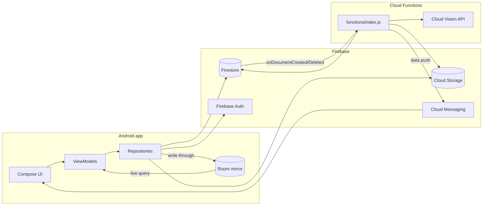

# Architecture

The deeper reference for how SmartPhotos is put together. [AGENTS.md](AGENTS.md) is loaded into
every agent conversation, so it states rules and keeps the reasoning short; **this file holds the
reasoning** — the incidents that produced a rule, the alternatives that were tried and rejected, and
the background an agent only occasionally needs. Read it when you want to know *why*, or when you
are about to change something a rule protects.

## System overview

Two deployables share one Firebase project:

- **Android app** — Kotlin + Jetpack Compose, MVVM, across sixteen Gradle modules: `:app`,
  `:core:domain`, `:core:common`, `:core:data`, `:core:ui`, nine `:feature:*` libraries, and the two
  test-only modules `:core:testing` / `:core:screenshot-testing`. Plus `build-logic/`, an included
  build holding the six convention plugins. The per-module contents and the dependency rules are in
  [AGENTS.md](AGENTS.md).
- **Cloud Functions** (`functions/`, Node 24) — triggered by Firestore writes and callable from the
  app, doing the work that shouldn't run on-device: calling Google Cloud Vision, enforcing limits
  the client can't be trusted to enforce, proxying secrets.

The two arrows between `Repo`, `Room` and `VM` are the shape worth noticing: a repository writes
what it fetched into Room, and the ViewModel reads it back out of a live query rather than from the
call's return value. That is the [Source of truth](AGENTS.md#source-of-truth) arrangement, and it is
what replaced the cross-feature event bus described below.

## Why the module split is shaped this way

The dependency rules in AGENTS.md are enforced at configuration time by
`smartphotos.android.feature`, which fails the build if a feature declares an edge to another
feature or to `:core:data`. That enforcement exists because **the one violation this build actually
shipped was invisible to review**: `:core:testing` declared `:core:data`, unused, on an `api`
configuration. Being `api`, it put Firestore, Room, DataStore and Play app-update on the unit-test
compile classpath of all nine feature modules — so "no feature depends on `:core:data`" held for
main sources and quietly failed for tests. Nobody had read a build file wrong; the rule was simply
held by convention, and conventions decay. Hence the check scans *every* declaration bucket, not
only the compile ones.

Removing that edge also freed `:core:data` to take `:core:testing` on `testImplementation` if a
suite there ever wants the fakes — with the edge in place that would have been a cycle. The general
form: **a fixtures module is a supplier to the data layer or a consumer of it, never both.**

`:core:screenshot-testing` was split out of `:core:testing` for the same reason, one layer over.
Everything in a fixtures module is `api`, so the harness's Roborazzi and Robolectric artifacts
landed on the unit-test compile classpath of all nine features plus `:app` and `:core:ui` —
including `:feature:explore`, which captures no screenshots and has no androidTest source set at
all, yet resolved the entire compose ui-test stack. The tell that nobody was relying on the leak:
every module wanting Robolectric for a *non*-screenshot suite (`:app`, `:core:data`,
`:feature:auth`, `:feature:note`, `:feature:preview`) already declared it itself.

**Neither is AGP's `testFixtures`.** That was tried first and doesn't work here: the Kotlin Android
plugin generates no Kotlin compilation for the testFixtures variant, so the sources never build.
Both are ordinary library modules, `api` throughout, because a fixtures module's API surface is
*other* modules' types — `FakeNoteRepository` **is** a `NoteRepository`.

`FirebaseModule` moved from `:app` to `:core:data` under the same kind of reasoning. Hilt aggregates
every `@InstallIn(SingletonComponent::class)` module into one component generated in `:app`, so a
provider works from anywhere and nothing fails if it sits too high — which is exactly why it sat in
the wrong place for so long. It provided seven Firebase SDK singletons whose only consumers were
`:core:data` repositories, which put the whole Firebase surface in `:app`'s dependency block for
code `:app` does not contain, and meant nothing below `:app` could assemble a repository on its own.
**Ask where a binding is injected, not where it is convenient to declare.**

## Layers

| Layer | Location | Responsibility |
| --- | --- | --- |
| UI | `<feature>/*Screen.kt` (`:feature:*`), `navigation/` (`:app`) | Render `UiState`, forward user intents. No Firebase/Room/DataStore calls, no business logic beyond UI-only state. |
| ViewModel | `<feature>/*ViewModel.kt` (`:feature:*`) | `@HiltViewModel`, exposes a `*UiState` via `StateFlow` wrapping a nested sealed loading/loaded/error content type. Depends on repository *interfaces* only. |
| Repository | interfaces in `:core:domain` (plus two in `:core:common`/`:core:data`), `Default*` implementations in `:core:data` | Coordinates remote (Firestore/Storage/Functions) and local (Room/DataStore). Exposes domain models only. Every fallible operation returns `Result<T>` via `safeCall`. |
| Domain | `domain/` (`:core:domain`) | Plain data classes (`HomeNote`, `MediaDetail`, `User`, …). No Android plugin on the module, so `import android.*` cannot compile. |
| Local | `database/`, `data/datastore/` (`:core:data`) | The Room mirror and preferences. Schemas exported to `core/data/schemas/`. |
| Remote | Firebase SDKs + `functions/index.js` | Auth, Firestore, Storage, Remote Config, Analytics, Crashlytics, FCM; Cloud Functions for anything needing a trusted server. |

Two repository interfaces cannot live in `:core:domain`, because their signatures carry Android
types. `AppUpdateRepository` (`ActivityResultLauncher`/`IntentSenderRequest`) stays in `:core:data`
beside its implementation, since only `:app`'s `MainViewModel` injects it. `MediaFileRepository`
(`Bitmap`/`Uri`) sits in `:core:common`, because a feature module injects it and must not depend on
`:core:data`. Move the next Android-typed interface down only when a feature actually needs it.

## Cross-feature updates, and the `*Handler` pattern that was removed

**There is no cross-feature event mechanism any more. Do not rebuild one.** If you find a comment
mentioning `NoteHandler` or `NoteActionsDelegate`, it is describing what the code used to do — both
classes are gone, and the comments were left deliberately to explain the absence.

The old arrangement: `home` and `favorite` held paginated, in-memory lists rather than a live query,
so a write in `note` (add/delete/favorite) did not propagate into a page `home` already had in
memory. To bridge that, each domain that needed to notify siblings had a `@Singleton` `*Handler`
exposing a `MutableSharedFlow` per event; the mutating ViewModel emitted after a successful write
and interested ViewModels collected in `init {}` and patched their own list.

It was removed because a default `MutableSharedFlow` has no replay, so a subscriber only receives an
event if it is actively collecting at emission time — the target ViewModel had to already be
constructed and past its `init {}`. That made it safe for "patch an already-visible list" and unsafe
for anything a screen must not miss, which is a distinction every future caller would have had to
re-derive correctly.

What replaced it is the Room mirror: the four note-rendering screens observe a live query over the
`notes` table, so a mutation on any screen shows up on every other screen with no event to deliver
and nothing to miss. `addNote` reading its own note back via `getNote` is what made this possible —
that one extra document read retired the `NoteHandler` event telling Home to refetch everything.
`NoteActionsDelegate` inlined into a small list transform in each ViewModel at the same time, since
there was no longer any shared subscription for it to own. The two `@ViewModelScoped` survivors in
`:core:common` are `NoteShareDelegate` (share-sheet plumbing) and `NoteErrorReporter` (the
`actionError` snackbar flow).

**The one event that remains** is `note/IncomingShareHandler.kt`, an event a screen genuinely must
not miss (an inbound Android share intent). It is deliberately *not* a `SharedFlow`: it is a
`StateFlow` holding the pending value plus an explicit `consume()`, so a subscriber that starts
collecting late still sees it. Copy that shape, not the old one, if a second such case ever appears.

The rules that keep the mirror correct — the `limit` on `getNotesStream`, mirror-write failures
having to fail the fetch, every remote read writing what it fetched, and the empty-state handling on
a fresh install — are in [AGENTS.md](AGENTS.md#source-of-truth), along with the two known gaps (no
offline writes, no reconciliation).

## Data flow: uploading a photo/note with ML tagging

This is the path that motivates having Cloud Functions at all:

1. The app uploads media to Cloud Storage and writes a note document to Firestore under
   `user/{userId}/note/{noteId}` (`DefaultNoteRepository`), then writes it through to Room. The
   upload runs in `viewModelScope` (`quickUploadMediaToFirebase`), so it is cancelled if the
   ViewModel is cleared mid-upload — official guidance for work that should survive that
   ([Guide to background work](https://developer.android.com/guide/background)) is `WorkManager`,
   which this codebase does not use today.
2. `processTextRecognition` (an `onDocumentCreated` trigger) fires server-side, calls Cloud Vision
   (text/label/object detection) on the uploaded image, and writes the results back onto the
   document.
3. The app picks up the update and refreshes the note's tags client-side.
4. On deletion, `archiveDeletedNote` (`onDocumentDeleted`) copies the note's Firestore data to
   `user/{userId}/archive/{noteId}` with a `deleted_at` timestamp, so it is recoverable rather than
   destroyed. The note's Storage files are left untouched.

The callable functions — `createNote`, `updateNote`, `isUsernameAvailable`, `isEmailRegistered`,
`createUserProfile`, `updateUsername`, `recordUserActivity`, `listUnsplashPhotos`,
`searchUnsplashPhotos` — exist because each needs a trusted environment: enforcing limits
(`MAX_USERNAME_LENGTH`, `MAX_POST_TEXT_LENGTH`, `MAX_NOTE_MEDIA_ITEMS`, reserved-username checks) a
modified client can't be trusted to self-enforce, holding a secret (`UNSPLASH_ACCESS_KEY`, via
`defineSecret`) that must never ship inside the APK, or — for `recordUserActivity` — needing a
Firestore transaction to compute streak continuation atomically against another device's concurrent
write. **Client-side checks mirroring these are UX-only; the functions are the enforcement
boundary.**

`createNote` returning only `{documentPath}` is why `addNote` reads its note back: the id and the
server-stamped `created` exist only server-side.

## Firestore collections

`firestore.rules` is deny-by-default; per-collection rules are additive (OR'd).

- `user/{userId}` — profile data, with a `note/{noteId}` sub-collection holding each user's notes
  (content, media metadata, Vision-derived tags). **This is where notes actually live.**
- `note/{noteId}` — a top-level collection of the same name exists but is explicitly locked down
  (`allow read, write: if false`) since the app doesn't use it. Don't confuse it with the
  sub-collection above.
- `username/{username}` — reservation records enforcing unique usernames, written via the
  `isUsernameAvailable`/`updateUsername` callables rather than direct client writes, so the
  reserved-word list in `functions/index.js` is enforced consistently.
- `user/{userId}/archive/{noteId}` — deleted notes plus a `deleted_at` timestamp, written by
  `archiveDeletedNote`. Fully locked down: it backs a server-side recovery mechanism, not a
  user-facing feature.

## Local persistence

Room (`database/`) mirrors a subset of Firestore for the read path:

- `NoteDao` / `DatabaseNote` (`@Entity(tableName = "notes")`) — the mirror the four note-rendering
  screens observe.
- `PhotoDao` / `DatabasePhoto` — cached photo metadata.

**A note's media list persists into the `notes.media_list` column as `kotlinx.serialization` JSON
keyed by `MediaDetail`'s property names.** That is an on-disk format, so renaming a property needs
`@SerialName` to keep old rows decodable. DataStore (`data/datastore/`) holds lightweight
preferences, not domain data.

Room is written through by the repository after the Firestore write returns, never independently —
see [Source of truth](AGENTS.md#source-of-truth).

## Dependency injection graph

Hilt. Every `@Provides`/`@Binds` module is `@InstallIn(SingletonComponent::class)`, and the
component is assembled in `:app` — which is why `:core:data` can inject `@IoDispatcher` and
`@DebugBuild` while their providers stay in `:app`'s `AppModule`.

| Module | Lives in | Provides |
| --- | --- | --- |
| `di/AppModule.kt` | `:app` | `CoroutineDispatcher`s via `@IoDispatcher`/`@ApplicationScope`, the `@DebugBuild` flag, app-wide bindings |
| `util/di/UtilModule.kt` | `:app` | `ErrorHandler`, `ResourceProvider` |
| `data/di/DataModule.kt` | `:core:data` | Binds each repository interface to its `Default*` |
| `data/di/FirebaseModule.kt` | `:core:data` | The Firebase SDK singletons |
| `data/datastore/DataStoreModule.kt` | `:core:data` | DataStore, and the one deliberate place a `CoroutineScope` is built at module level rather than injected |
| `database/di/DatabaseModule.kt` | `:core:data` | `AppDatabase` and its DAOs |

`di/Qualifiers.kt` (`:core:domain`) holds the `@IoDispatcher`, `@ApplicationScope` and `@DebugBuild`
annotations themselves, kept apart from the providers because they are plain JSR-330 and can live in
a pure-JVM module while `@Provides` methods cannot.

**Not everything is a `@Singleton`.** `NoteShareDelegate` and `NoteErrorReporter` (`:core:common`)
are `@ViewModelScoped` via a plain `@Inject` constructor — the
[scope](https://developer.android.com/training/dependency-injection/hilt-android#component-scopes)
that matches their actual lifetime, with no module needed since Hilt resolves them straight from the
constructor. There is no per-feature `di/` package; bindings live in one of the six modules above.

## Incidents worth not repeating

Each of these produced a rule in AGENTS.md. They are recorded here because the rule is easy to
follow and hard to re-derive.

- **A `@Preview` broke the release build for weeks.** `:feature:auth` used a dependency that reached
  it only through `debugImplementation`, so `assembleDebug`, the unit tests, Roborazzi and
  `lintDebug` all compiled clean while `compileReleaseKotlin` failed. Nothing caught it because CI
  built no release either. `assembleRelease` is now a CI step, and
  `compileDebugAndroidTestKotlin` alongside it — between them they cover the two variants nothing
  else compiles. The androidTest one has its own catch to its name: `:core:data`'s DataStore and
  Room bindings.
- **The dependency sweep got the "loaded reflectively" exception wrong in both directions.**
  `firebase-inappmessaging-display` was kept because a `provideFirebaseInAppMessaging` binding named
  it — but nothing in the build ever injected that binding, and an unused Hilt binding reads exactly
  like a live one, with no import to be missing and no compile error to raise. **Check for an
  injection site before treating a `@Provides` as load-bearing.** `coil-gif` went the other way: it
  was removed because "nothing registers a GIF decoder here", which under Coil 3 is precisely what a
  *working* setup looks like. It and `coil-network-okhttp` ship a `META-INF/services` entry
  (`coil3.util.DecoderServiceLoaderTarget` / `FetcherServiceLoaderTarget`) that Coil reads when
  building an `ImageLoader`, so classpath presence **is** the registration. GIFs stopped animating
  and nothing failed to compile. **Look inside the artifact before deleting a dependency nothing
  imports.**
- **`:app` carried ML Kit ×4, GenAI, media3 ×4 and `material-icons-extended` long after the code
  that used them moved into feature modules.** Unused dependencies cost nothing at compile time, so
  they survive every refactor that should have removed them. A module declares what its own sources
  name.
- **KSP's incremental state goes stale when a type moves between modules**, producing a wall of
  `InjectProcessingStep was unable to process 'X(…,Foo,…)' because 'Foo' could not be resolved` for
  a type that is on the classpath and compiles fine alone. `./gradlew clean` fixes it. The tell is
  that the unresolved name is unqualified while its neighbours from the same module are fully
  qualified — check this before rearranging `api`/`implementation` declarations.
- **CI's artifact path lists drifted three times** while they were literal per-module paths:
  `:core:ui`, `:feature:explore` and `:feature:settings` each silently reported nothing for a while,
  which turns a failure in that module into a red X with nothing to open. They are globs now.
- **Screenshot goldens were machine-dependent** until the unit-test JVM was pinned to UTC/en-US, because
  `Long.toFormattedDateTime()` defaults `zone`/`locale` to the system's — they passed on a UTC+8
  laptop and failed on the UTC runner. A golden diff appearing only on CI is far more likely
  non-determinism in the test than a platform rendering difference.
- **Tests do not move themselves when their subject does, and nothing fails when they stay.** `:app`
  kept both `Default*Repository` suites and a screenshot test of two feature screens simply because
  its test classpath could still see everything. When a test *cannot* follow its subject down, that
  is a finding: those two suites were asserting the rendered error *message* through `:app`'s
  `DefaultErrorHandler`, a layer above their subject. Splitting the assertion at the `AppError`
  identity — the message half was already pinned by `ErrorMessageMappersTest`, where it belongs —
  is what let them move.
- **`ProfileScreenTest` is device-only on purpose.** Promoting it to `sharedTest/` was tried and
  three of five tests passed under Robolectric; its bottom-anchored save button and inline
  validation text depend on real viewport and scroll behaviour. Check an existing androidTest-only
  suite's own note before promoting it.
- **`smartphotos.android.feature` did not exist while `:feature:explore` was the only feature
  module**, because with one consumer there is no way to tell *the shape of a feature* from *the
  shape of Explore*. The second consumer answered it, and partly against expectation — the icon
  packs, assumed Explore-specific, turned out to be shared. One module is a sample size of one.

## Kotlin Multiplatform

The long-term intent is to share `domain/`, the repository interfaces and other business logic. The
day-to-day rules that keep that cheap are in [AGENTS.md](AGENTS.md#kotlin-multiplatform-readiness);
this is the state of play.

**The next actual step is converting `:core:domain` from `kotlin.jvm` to `kotlin.multiplatform`**
(`commonMain` + `androidTarget()`). Nearly every import in its main sources is already multiplatform
— `kotlin.time.Instant`, `kotlinx.coroutines`, `kotlinx.datetime`, `kotlinx.serialization` — with
one exception: `javax.inject.Qualifier` in `di/Qualifiers.kt`, which would move to an `androidMain`
source set since Hilt is Android-only.

**The ceiling to know about before planning further: Hilt has no KMP support, and it is load-bearing
below `:app`.** Every `Default*` is an `@Inject constructor` and `DataModule` is
`@InstallIn(SingletonComponent::class)`. A genuinely shared data layer would need Koin or
hand-written constructor wiring, with Hilt confined to the Android edge. **That decision, not module
splitting, is what sets how far KMP can go here.**

Be honest about what the module extraction bought: `:core:data` and `:core:ui` are Android libraries
full of Firebase, Room and Compose, and the nine `:feature:*` modules are Compose end to end — the
*least* shareable code in the build. Nothing in them became shareable by moving. That work was
modularization; it was not KMP progress, and the two shouldn't be reported as one number.

The module names deviate from Google's Now in Android deliberately. `:core:domain` here holds domain
models, pure repository interfaces, `safeCall` and the DI qualifiers, where NiA's equivalent split
keeps repository implementations alongside the interfaces — impossible here, since `:core:data`
needs the Android plugin. Keep the note rather than renaming to `:core:model`, which would be
inaccurate: it holds more than models.

## Where this can drift from reality

This file is hand-written and enforced by no build check, unlike the layering rules (which
`smartphotos.android.feature` fails the build over) and `:core:domain`'s purity (which the compiler
rejects). **If something here disagrees with the code, trust the code** — and update this file.

It has drifted before: it described three Gradle modules after the split to sixteen, and documented
the `*Handler` event bus as current for some time after the Room mirror replaced it, which is worse
than saying nothing — an agent reading it would have rebuilt a pattern AGENTS.md forbids.
