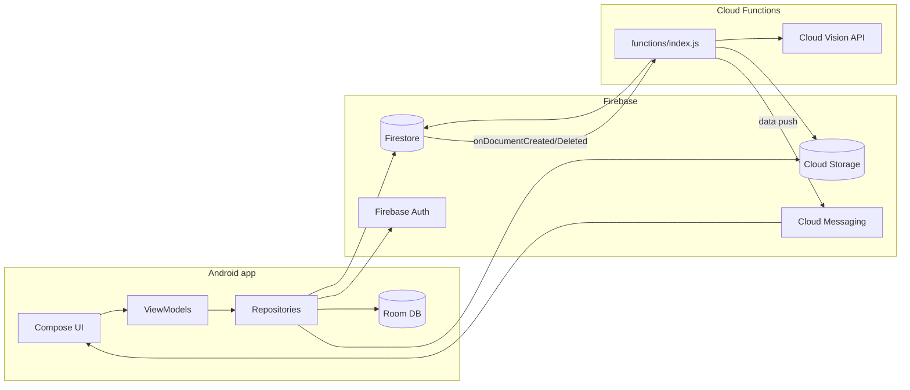
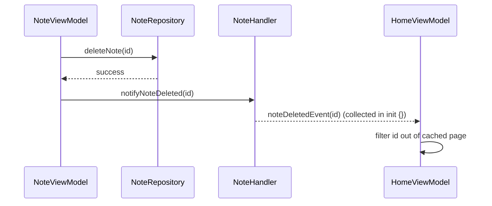

# Architecture

This is a deeper reference for how SmartPhotos is put together. For build/test commands and
day-to-day conventions, see [AGENTS.md](AGENTS.md) — that file is loaded into every agent
conversation, so it stays intentionally terse; this one is for when you need the fuller picture.

## System overview

Two deployables share one Firebase project:

- **Android app** (`app/`) — single `:app` module, Kotlin + Jetpack Compose, MVVM.
- **Cloud Functions** (`functions/`) — Node.js, triggered by Firestore writes and callable from
  the app, does the work that shouldn't run on-device: calling Google Cloud Vision, enforcing
  limits the client can't be trusted to enforce, proxying secrets.

## Layers

| Layer      | Location                                          | Responsibility                                                                                                                                                                                                                                           |
|------------|---------------------------------------------------|----------------------------------------------------------------------------------------------------------------------------------------------------------------------------------------------------------------------------------------------------------|
| UI         | `<feature>/*Screen.kt`, `navigation/`             | Render `UiState`, forward user intents. No Firebase/Room/DataStore calls, no business logic beyond UI-only state (scroll position, sheet visibility).                                                                                                    |
| ViewModel  | `<feature>/*ViewModel.kt`                         | `@HiltViewModel`, exposes a `*UiState` data class via `StateFlow` wrapping a nested sealed loading/loaded/error content type (e.g. `HomeContent`). Depends on repository *interfaces* only.                                                              |
| Repository | `data/repository/`                                | One interface + one `Default*` impl per repository. Coordinates remote (Firestore/Storage/Functions) and local (Room/DataStore) sources; the single source of truth for its domain. Exposes domain models only, never `DocumentSnapshot`/Room `@Entity`. |
| Domain     | `domain/`                                         | Plain data classes (`HomeNote`, `MediaDetail`, `Photo`, `User`, …), no Android/Firebase/Room dependency.                                                                                                                                                 |
| Local      | `database/` (Room), `data/datastore/` (DataStore) | On-device cache/persistence. Room schemas exported to `app/schemas/`.                                                                                                                                                                                    |
| Remote     | Firebase SDKs + `functions/index.js`              | Auth, Firestore, Storage, Remote Config, Analytics, Crashlytics, FCM; Cloud Functions for anything that needs a trusted server (Vision API calls, validation, secrets).                                                                                  |

Each feature (`home`, `note`, `favorite`, `search`, `profile`, `settings`, `auth`, `explore`,
`preview`, `notification`) is a self-contained Kotlin package following UI → ViewModel →
Repository. Repositories are shared across features (e.g. `NoteRepository` is used by `note`,
`home`, and `favorite`), which is why cross-feature sync needs an explicit mechanism — see below.

## Cross-feature communication: the `*Handler` pattern

Repositories are the source of truth, but `home` and `favorite` hold **paginated, in-memory-cached**
lists (`currentPage`/`pageSize`/`hasMoreData`, see `AppConstants.DEFAULT_PAGE_SIZE`) rather than a
live reactive query. That means a write in `note` (add/delete/favorite) doesn't automatically
propagate into a page `home` already has in memory — there's no Flow to re-collect.

To bridge that, each domain that needs to notify siblings has a `@Singleton`-scoped `*Handler`
(e.g. `note/NoteHandler.kt`) exposing `MutableSharedFlow`s per event (`noteAddedEvent`,
`noteDeletedEvent`, `noteFavoritedEvent`). The mutating ViewModel emits after a successful write;
interested ViewModels collect in `init {}` and patch their in-memory list.

**Known limitation:** a default `MutableSharedFlow` has no replay — a subscriber only receives an
event if it's actively collecting at emission time. In practice this means the target ViewModel
must already be constructed (past its `init {}`) when the event fires; screens not yet created
simply reload fresh from the repository next time they're opened, so this is safe for "patch an
already-visible list" use cases but should not be used for anything a screen must never miss.

## Data flow: uploading a photo/note with ML tagging

This is the path that motivates having Cloud Functions at all, rather than doing everything
on-device or in security rules:

1. App uploads media to Cloud Storage and writes a note document to Firestore under
   `user/{userId}/note/{noteId}` (`DefaultNoteRepository`), then caches it locally via `NoteDao`
   (Room). The upload runs in `viewModelScope` (`NoteViewModel.quickUploadMediaToFirebase`), so it
   is cancelled if the ViewModel is cleared (navigation away, process death) mid-upload — official
   guidance for work that should survive that ([Guide to background
   work](https://developer.android.com/guide/background)) is `WorkManager` rather than a
   ViewModel-scoped coroutine; this codebase doesn't do that today.
2. `functions/index.js`'s `processTextRecognition` (`onDocumentCreated` trigger on
   `user/{userId}/note/{noteId}`) fires server-side, calls Cloud Vision (text/label/object
   detection) on the uploaded image, and writes the results back onto the Firestore document.
3. The app's Firestore listener picks up the update and refreshes the note's tags client-side.
4. On note deletion, `archiveDeletedNote` (`onDocumentDeleted`) copies the deleted note's
   Firestore data to `user/{userId}/archive/{noteId}` (plus a `deleted_at` timestamp) so it's
   recoverable rather than permanently destroyed; the note's Storage files (photo/video/
   thumbnail) are left untouched.

Other callable functions (`createNote`, `isUsernameAvailable`, `isEmailRegistered`,
`createUserProfile`, `updateUsername`, `recordUserActivity`, `listUnsplashPhotos`) exist because
they need a trusted environment: enforcing limits (`MAX_USERNAME_LENGTH`, `MAX_POST_TEXT_LENGTH`,
`MAX_NOTE_MEDIA_ITEMS`, reserved-username checks) that a compromised or modified client can't be
trusted to self-enforce, holding a secret (`UNSPLASH_ACCESS_KEY`, via `defineSecret`) that must
never ship inside the APK, or (for `recordUserActivity`) needing a Firestore transaction to
compute streak continuation atomically, which the client SDK can't do against another device's
concurrent write. Client-side checks mirroring these (`ValidationUtils.kt`, `AppConstants.kt`) are
UX-only — the functions are the actual enforcement boundary.

## Firestore collections

Collections referenced by `firestore.rules` (deny-by-default; rules below are additive):

- `user/{userId}` — profile data, with a `note/{noteId}` sub-collection holding each user's notes
  (content, media metadata, Vision-derived tags) — this is where notes actually live.
- `note/{noteId}` — a top-level collection of the same name exists but is explicitly locked down
  (`allow read, write: if false`) since it's unused by the app; don't confuse it with the
  `user/{userId}/note` sub-collection above.
- `username/{username}` — reservation records enforcing unique usernames (checked/written via the
  `isUsernameAvailable`/`updateUsername` callables rather than direct client writes, so the
  reserved-word list in `functions/index.js` is enforced consistently).
- `user/{userId}/archive/{noteId}` — deleted notes' Firestore data plus a `deleted_at`
  timestamp, written by `archiveDeletedNote` when a note is deleted; fully locked down (no
  client access) since this only backs a server-side recovery mechanism, not a user-facing
  feature yet.

## Local persistence

Room (`database/`) mirrors a subset of Firestore data for offline/fast-path reads:

- `NoteDao` / `DatabaseNote` — cached notes, mapped to/from `HomeNote` via `toDatabaseNote()` /
  `toHomeNote()` in `database/data/`.
- `PhotoDao` / `DatabasePhoto` — cached photo metadata.

Room is a cache the repository populates and reads through, not an independent source of truth —
writes go to Firestore first (via the repository), then to Room, so the two don't diverge on
success. DataStore (`data/datastore/`) holds lightweight preferences (not domain data).

## Dependency injection graph

Hilt. Most bindings are `@InstallIn(SingletonComponent::class)`, but a handful of collaborators
used only within a single feature's ViewModel are `@ViewModelScoped` via a plain `@Inject`
constructor instead (e.g. `note/NoteActionsDelegate.kt`, `note/NoteShareDelegate.kt`) — the
narrower [Hilt scope](https://developer.android.com/training/dependency-injection/hilt-android#component-scopes)
that actually matches their lifetime, rather than defaulting everything to `@Singleton`.

- `di/AppModule.kt`, `di/FirebaseModule.kt` — app-wide bindings (Firebase SDK instances,
  `CoroutineDispatcher`s via `@IoDispatcher`/`@ApplicationScope`, the `@DebugBuild` flag,
  cross-feature `@Singleton` `*Handler`s like `NoteHandler` provided via `@Provides` rather than a
  class-level annotation, etc.).
- `di/Qualifiers.kt` — the `@IoDispatcher`, `@ApplicationScope` and `@DebugBuild` annotations
  themselves, kept apart from the providers above because they are plain JSR-330 and can move to a
  shared module while the `@Provides` methods cannot.
- `data/di/DataModule.kt` — binds each repository interface to its `Default*` implementation.
- `database/di/` — provides `AppDatabase` and its DAOs.
- `util/di/UtilModule.kt` — utilities like `ErrorHandler`.

There is currently no per-feature `di/` package (`note/`, `search/`, etc. have none) — all
`@Provides`-based `SingletonComponent` bindings live in one of the four module locations above,
even ones a single feature owns exclusively (e.g. `NoteHandler` is provided from
`di/AppModule.kt`, not a `note/di/` module). The `@ViewModelScoped` classes above are the
exception: Hilt resolves them straight from their `@Inject` constructor, no module needed.

ViewModels and repositories are constructor-injected against interfaces only; nothing outside
`data/di/` constructs a `Default*` repository directly.

## Where this can drift from reality

This file is hand-written and not enforced by any build check, unlike code style
(`kotlin.code.style=official`) — it can go stale as the codebase evolves. If something here
disagrees with the code, trust the code, and send a PR updating this file.
